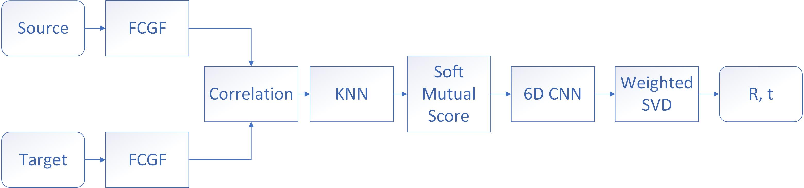

# Dgr-ncnet
Referring to [Neighbourhood Consensus Networks](https://www.ecva.net/papers/eccv_2020/papers_ECCV/papers/123540579.pdf), we modify the [Deep Global Registration]([chrischoy/DeepGlobalRegistration: [CVPR 2020 Oral\] A differentiable framework for 3D registration (github.com)](https://github.com/chrischoy/DeepGlobalRegistration)) to utilize neighborhood consensus of correspondences instead of just the nearest neighbor. The pipeline is shown below. We develop two PyTorch extensions to accelerate the Soft Mutual Score Module and KNN module.

